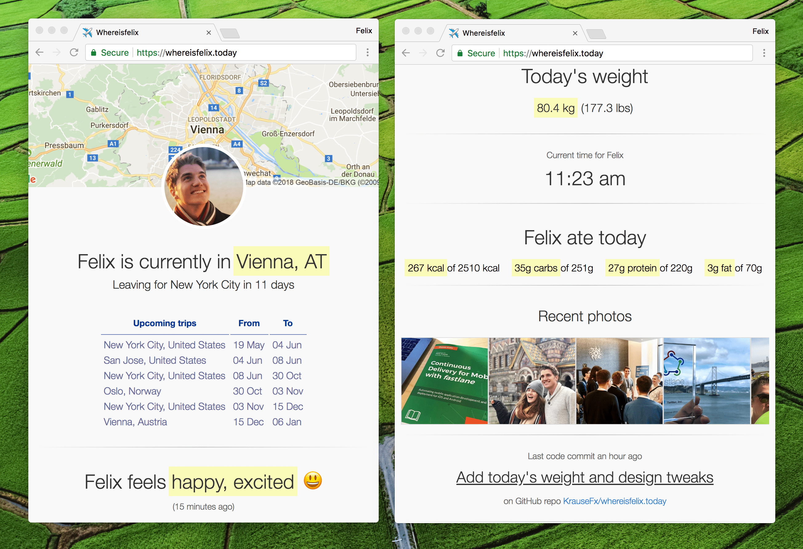

# [`howisFelix.today`](https://howisFelix.today)

## See the result on <a href="https://howisFelix.today/">howisFelix.today</a>


<h2 align=center>See the result on <a href="https://howisFelix.today/">howisFelix.today</a></h2>
<p />


<table>
  <tr>
    <td>
      
    </td>
    <td>
      
    </td>
    <td>
      
    </td>
  </tr>
</table>

## Development dependencies

```
npm install
```

## Server

Run dev server
```
npm run dev
```

Push to production
```
npm run dev # to convert typescript
git push heroku master
```

## Frontend

The frontend got moved to [krausefx/howisFelix.today](https://howisFelix.today)

## Instagram

### New approach

Since Facebook doesn't like people using their platform (https://twitter.com/KrauseFx/status/1496158344951873548), and we can't even scrape a public profile, I now have to manually copy & paste my photos. For now, I'm just doing it as part of this repo.

### Old approach: Surprise surprise, Instagram shut down all APIs

Since the Instagram API isn't perfect right now, and probably never will in the near future, this is how you can renew the access token:

- Get the `Client ID` from [instagram.com/developer/clients/manage](https://instagram.com/developer/clients/manage/)
- Open `https://www.instagram.com/oauth/authorize/?client_id=[Client ID]&redirect_uri=https://whereisfelix.today&response_type=token`
- Copy & paste the Access Token from the resulting URL after confirming and set it as ENV variable for `INSTAGRAM_ACCESS_TOKEN`

### Old Version




